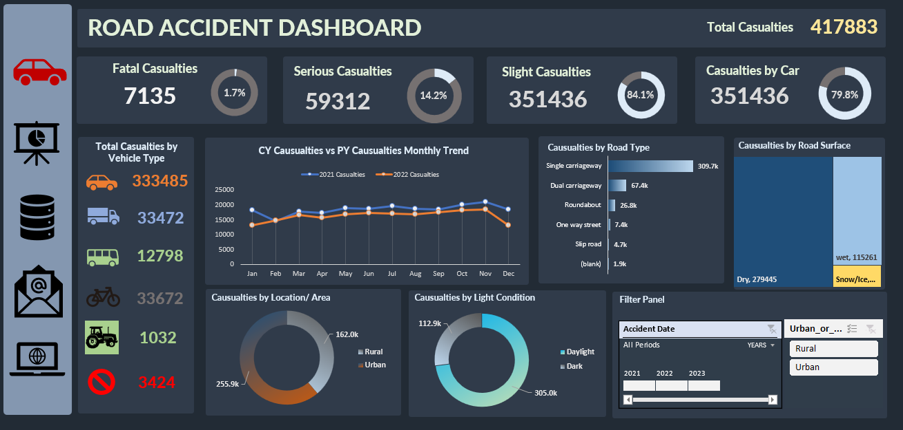

# 🚧 Road Accident Data Analytics Dashboard

## 📌 Project Overview

This **Road Accident Dashboard** is a comprehensive, insight-rich visualization project developed using **Power BI** to analyze and monitor road safety trends. The dashboard aggregates and explores key variables such as **accident types, vehicle involvement, road conditions, casualty severity, and geographic distribution**.

> As showcased in the image above, this dashboard provides a **360-degree view of road accident data**, enabling stakeholders to identify high-risk zones, driving conditions, and policy intervention points with precision.

---

## 🎯 Purpose

The aim of this project is to equip **transportation authorities**, **urban planners**, and **safety analysts** with the tools they need to:

- Monitor accident severity in real time
- Identify high-casualty road types and surfaces
- Understand correlations between light, location, and accident rate
- Prioritize public safety interventions using data-backed insights

---

## 📊 Key Metrics & Insights

- **Total Casualties**: 417,883  
- **Fatalities**: 7,135 (1.7%)  
- **Serious Casualties**: 59,312 (14.2%)  
- **Slight Casualties**: 351,436 (84.1%)  
- **Car-related Casualties** account for nearly 80% of all incidents

### 🔍 Breakdown Highlights (as visualized above)

- 📉 **Monthly Trends** show 2022’s casualty rates outpacing 2021 across most months
- 🚘 **Vehicle Type**: Cars dominate with over 333K casualties, followed by cycles and goods vehicles
- 🛣️ **Road Type**: Single carriageways are the most dangerous (309.7K casualties)
- 🌧️ **Surface Condition**: Wet roads lead to significantly more casualties than icy or dry roads
- 🌍 **Location Analysis**: Urban areas see 255.9K casualties vs 162.0K in rural settings
- 🌙 **Light Conditions**: Daylight accidents far exceed those occurring in the dark
- 📅 **Filter Panel** allows for interactive filtering by year and location

---

## 🛠 Tools & Technologies Used

- **Power BI Desktop** – For data modeling, dashboard development, and interactivity
- **Power Query** – For transformation, cleaning, and merging datasets
- **DAX** – For measures like percentage breakdowns, YOY trends, and time intelligence
- **Excel / CSV** – Source data structuring

---

## ✅ Skills Demonstrated

- 📌 Real-Time Monitoring Dashboards  
- 📈 Time Series & Trend Analysis  
- 📊 Geospatial & Dimensional Analytics  
- 🧩 Data Modeling with Multiple Relationships  
- 📉 Public Policy Insight through Data  
- 🧠 Visual Storytelling & UI/UX Clarity  
- 🧼 Data Preparation & Transformation

---

## 👨‍💼 About Me

I’m **Tosin Bello**, a passionate **Data Analyst and Data Scientist** specializing in converting raw public and enterprise datasets into impactful decision-making dashboards. This project reflects my ability to apply data science principles to real-world safety challenges — and communicate insights in a form that drives **policy, prevention, and performance**.

📬 **Let’s connect**:

- **LinkedIn**: [Tosin Bello](https://www.linkedin.com/in/tosinbellofin)  
- **Email**: toshineb@email.com

---

## 📂 How to Explore

To interact with the dashboard (if PBIX is provided):

1. Download the `.pbix` file from the repo.
2. Open using **Power BI Desktop**.
3. Use filters (year, rural/urban) to explore data across locations and time.

---

## ⭐ Like this project? Give it a ⭐ and follow for more dashboards solving real-world problems.
